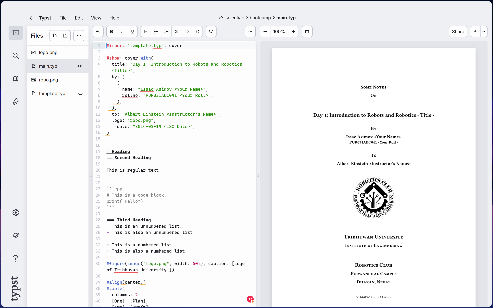
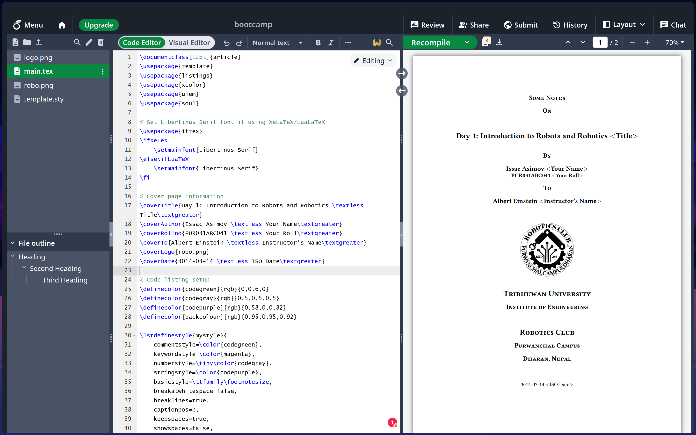

# doc-templates
Templates for Documentaiton of Robotics Bootcamp

> [!IMPORTANT]  
>  Before submitting your pdf, rename it in the following format:
> `<first-name>-<last-name>-<rollno>.pdf` for eg: `albert-einstein-pur031sci415.pdf`.
> Every letter should be small letter with no spaces in the filename.

## Setting Up
For ease of use, you can import these templates on [typst.app](https://typst.app) for `typst`.  
And, for `latex` you can make use of [www.overleaf.com](https://www.overleaf.com).

And if you want to set these things up locally to use without an internet connection you can find the Documentation on how to do that here:

[typst/typst](https://github.com/typst/typst)  
[tug.org/texlive](https://tug.org/texlive)

> [!NOTE]
> You can even set it up to use these with your IDE of choice with a little bit of research.

## How do I use it?
For anyone familiar with `git` you can clone this repo and work accordingly but if you aren't you can [click here](https://github.com/Robotics-Club-IOEPC/doc-templates/archive/refs/heads/main.zip), extract the zip file and then import the respective folder on your respetive typesetting software of choice.

> [!TIP]
> _When creating the projects on the respective apps, choose a blank project with nothing on it and import the files._

## How should it look like?
How should the apps look like for me to know that everything is properly set up?

### Typst

### Overleaf (Latex)

## Note
- These templates are very barebones, you'd utilize `bibtex` for reference and bibliography when needed on `latex` and similar equivalent to typst for better formatting of references. (Which, itn't set up in this template.)
- You can extend anything to this template and it will be accepted. (If your instructor likes what you have tried to do, it might even be merged to the main template.)
- `Latex` is oldschool, huge, slow and heavy but it is used everywhere in the industry; from making books to publishing white papers. 
- `Typst` is new, small, fast, easy and used by many people since it is blazingly fast but, it isn't adopted by the larger industry yet.

> If you feel that this is difficult and you want to do this in Google Docs or Microsoft Word, you may recreate the cover page and template formatting and export to pdf before submitting. (I am sure by doing that you'll realize you were better off learing how to use one of these.)

> But, I highly recommend using one of the above two typesetting software since it will come handy in your everyday engineering days like submitting **lab reports** or making **reports** and **proposals**.
